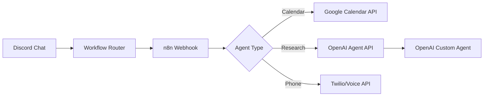
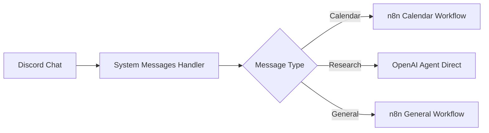

# OpenAI Agent Integration with n8n

## Overview

This document outlines how to integrate OpenAI's agent capabilities (like Deep Research) with your n8n workflows, alongside the existing calendar integration.

## Architecture Options

### Option 1: Direct OpenAI Integration in n8n (Recommended)



**Advantages:**
- Centralized workflow management
- Consistent error handling
- Single point of configuration
- Easy to add new agent types

### Option 2: Hybrid Approach (Current Implementation)



## Setting Up OpenAI Agent in n8n

### 1. Create OpenAI Agent Node in n8n

```json
{
  "parameters": {
    "model": "gpt-4-turbo",
    "assistantId": "asst_your_assistant_id",
    "options": {
      "tools": [
        {
          "type": "retrieval"
        },
        {
          "type": "code_interpreter"
        },
        {
          "type": "function",
          "function": {
            "name": "web_search",
            "description": "Search the web for information"
          }
        }
      ]
    }
  },
  "name": "OpenAI Research Agent",
  "type": "@n8n/n8n-nodes-langchain.agent",
  "position": [2520, -500]
}
```

### 2. Configure Assistant in OpenAI Platform

1. Go to https://platform.openai.com/assistants
2. Create new assistant with:
   - **Name**: "Discordant Research Agent"
   - **Instructions**: Custom prompt for your use case
   - **Tools**: Enable Code Interpreter, Retrieval, and custom functions
   - **Model**: GPT-4 Turbo or newer

### 3. Add Custom Functions for Deep Research

```javascript
// Custom function for deep research
const deepResearchFunction = {
  name: "deep_research",
  description: "Perform deep research on a topic using web search and analysis",
  parameters: {
    type: "object",
    properties: {
      query: {
        type: "string",
        description: "The research query"
      },
      depth: {
        type: "string",
        enum: ["quick", "standard", "deep"],
        description: "How thorough the research should be"
      },
      sources: {
        type: "array",
        items: { type: "string" },
        description: "Specific sources to prioritize"
      }
    },
    required: ["query"]
  }
};
```

## Phone Automation Integration

### Adding Twilio for Phone Calls

1. **Add Twilio Node to n8n**:
```json
{
  "parameters": {
    "operation": "call",
    "to": "={{ $json.phoneNumber }}",
    "from": "={{ $env.TWILIO_PHONE_NUMBER }}",
    "url": "https://your-domain.com/twiml/voice-script"
  },
  "name": "Make Phone Call",
  "type": "n8n-nodes-base.twilio"
}
```

2. **Create TwiML Script for Call Flow**:
```xml
<?xml version="1.0" encoding="UTF-8"?>
<Response>
    <Say voice="alice">Hello, this is Kenneth's automated assistant calling from National Registration Group.</Say>
    <Gather input="speech" action="/handle-response" timeout="3">
        <Say>{{ $json.message }}</Say>
    </Gather>
    <Say>Thank you for your time.</Say>
</Response>
```

3. **Add to Workflow Router**:
```typescript
{
  pattern: /call|phone|dial|contact|reach out/i,
  keywords: ["call", "phone", "dial"],
  priority: 8,
  workflowId: "phone-automation",
  webhookPath: "phone-automation-services",
  description: "Phone call automation and scheduling"
}
```

## Connecting Everything Together

### Updated n8n Workflow Structure

```javascript
// Main AI Agent node with all tools
{
  "parameters": {
    "promptType": "define",
    "text": "={{ $json.input }}",
    "options": {
      "systemMessage": `You are Kenneth's comprehensive assistant with access to:
        - Calendar management (Google Calendar)
        - Deep research capabilities (OpenAI Research)
        - Phone automation (Twilio)
        - Web browsing and analysis
        
        Route requests to appropriate tools based on user intent.`
    }
  },
  "id": "main-agent",
  "name": "Unified AI Agent",
  "type": "@n8n/n8n-nodes-langchain.agent"
}
```

### Tool Connections

```javascript
// Connect all tools to the main agent
connections: {
  "View_Calendar_Events": { "ai_tool": [["Unified AI Agent", "ai_tool", 0]] },
  "Create_New_Event": { "ai_tool": [["Unified AI Agent", "ai_tool", 0]] },
  "OpenAI_Research": { "ai_tool": [["Unified AI Agent", "ai_tool", 0]] },
  "Twilio_Phone": { "ai_tool": [["Unified AI Agent", "ai_tool", 0]] },
  "Web_Browser": { "ai_tool": [["Unified AI Agent", "ai_tool", 0]] }
}
```

## Environment Variables

Add these to your `.env` file:

```bash
# OpenAI
OPENAI_API_KEY=sk-...
OPENAI_ASSISTANT_ID=asst_...
OPENAI_ORG_ID=org-...

# Twilio
TWILIO_ACCOUNT_SID=AC...
TWILIO_AUTH_TOKEN=...
TWILIO_PHONE_NUMBER=+1234567890

# n8n
N8N_WEBHOOK_URL=https://n8n.kendev.co/webhook
```

## Example Use Cases

### 1. Research + Calendar
"Research the best times for B2B calls next week and schedule them"

### 2. Phone + Calendar
"Call John about the meeting and if he answers, schedule a follow-up for next Tuesday"

### 3. Multi-Step Workflow
"Find contact info for potential clients in the tech industry, call the top 5, and schedule meetings with interested parties"

## Benefits of This Architecture

1. **Unified Interface**: Single chat interface for all operations
2. **Context Preservation**: n8n maintains conversation context
3. **Error Recovery**: Centralized error handling
4. **Extensibility**: Easy to add new agent types
5. **Audit Trail**: All actions logged in n8n
6. **Cost Optimization**: Route to appropriate service based on need

## Migration Path

1. Start with current implementation (calendar via n8n)
2. Add OpenAI Research agent to n8n workflow
3. Test phone automation separately
4. Gradually migrate all handlers to unified workflow
5. Deprecate individual handlers in favor of WorkflowHandler

## Security Considerations

- Store all API keys in n8n credentials
- Use webhook authentication for all endpoints
- Implement rate limiting for phone calls
- Audit all automated actions
- Require confirmation for sensitive operations 