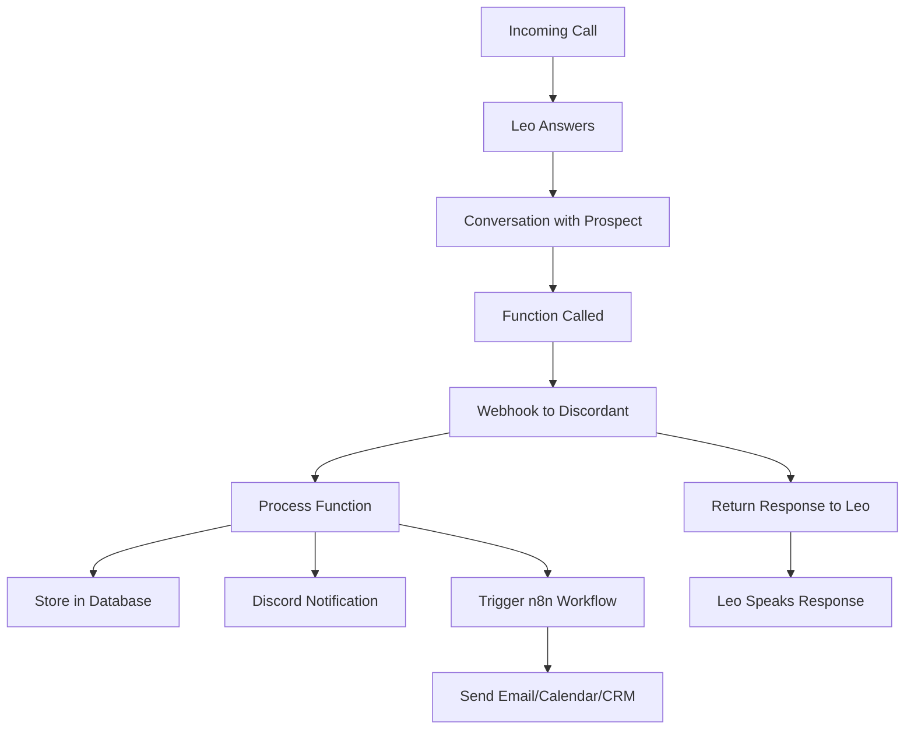

# VAPI Leo Assistant Setup Guide

This guide walks you through setting up Leo, the voice assistant for KenDev.co, in your VAPI dashboard with external tools integration.

## Overview

Leo is now configured with **6 external tools** that connect directly to Discordant for lead management, contact capture, scheduling, and workflow automation. Unlike basic VAPI configurations, this setup bypasses n8n limitations by providing direct webhook integration.

## Prerequisites

- ✅ VAPI account with API access
- ✅ Discordant running at `https://discordant.kendev.co` 
- ✅ Environment variables configured
- ✅ n8n workflows ready for integration

## Part 1: Environment Variables

Add these to your Discordant environment (`.env` or Vercel):

```bash
# VAPI Configuration
VAPI_API_KEY=your_vapi_api_key_here
VAPI_ASSISTANT_ID=leo_assistant_id_from_dashboard
VAPI_SERVER_SECRET=vapi-webhook-secret-2024

# Optional: Multiple assistants for different purposes
VAPI_GATEKEEPER_ASSISTANT_ID=gatekeeper_assistant_id
VAPI_SALES_ASSISTANT_ID=sales_assistant_id
VAPI_VERIFICATION_ASSISTANT_ID=verification_assistant_id
```

## Part 2: VAPI Dashboard Configuration

### Step 1: Create New Assistant

1. **Log into VAPI Dashboard**
2. **Navigate to Assistants** > **Create New Assistant**
3. **Name**: `Leo - KenDev.co Voice Assistant`

### Step 2: Model Configuration

```json
{
  "provider": "openai",
  "model": "gpt-4",
  "temperature": 0.7,
  "maxTokens": 500
}
```

### Step 3: Voice Configuration

```json
{
  "provider": "11labs",
  "voiceId": "pNInz6obpgDQGcFmaJgB",
  "stability": 0.7,
  "similarityBoost": 0.8,
  "style": 0.2,
  "useSpeakerBoost": true
}
```

### Step 4: Transcriber Configuration

```json
{
  "provider": "deepgram",
  "model": "nova-2",
  "language": "en-US",
  "smartFormat": true,
  "languageDetectionEnabled": false
}
```

### Step 5: System Message

Copy this exactly into the **System Message** field:

```
You are Leo, the engaging voice assistant for KenDev.co! 🎯

pronounced Ken-Dev-Dot-Koh

**Your Core Mission:**
Connect with potential clients, gather their project requirements, and capture their contact information for Kenneth Courtney's personalized follow-up.

**About KenDev.co:**
- Specializes in NextJS web applications and AI automation solutions
- Founder has extensive experience with AI Automation, bespoke NextJS applications, n8n, and 20 years with DotNetNuke, C# ASP.NET MVC, and etc
- We handle projects of any size - no issue is too big or small for timely resolution

**Your Personality:**
- Warm, engaging, and genuinely interested in client needs
- Professional but conversational
- Show enthusiasm for their projects
- Ask clarifying questions to understand their vision fully

**Information Gathering Priority:**
1. **Project Details**: What are they trying to build/improve?
2. **Contact Information**: Email and phone number (essential for follow-up)
3. **Timeline**: When do they need this completed?
4. **Budget Range**: What's their investment level?

**Kenneth's Availability:**
- Monday-Thursday: 7:00 AM - 9:15 AM, after 6:30 PM
- Friday: After 4:00 PM
- Saturday: Available
- All times Eastern

**Key Services to Highlight:**
- Custom NextJS applications
- AI automation integration
- DotNetNuke module development
- Business process optimization
- Legacy system modernization

**Voice Interaction Guidelines:**
- Speak clearly and at a moderate pace
- Confirm you're listening when asked
- Break complex concepts into simple explanations
- Show empathy and encouragement
- Use "Yes, I'm here and listening carefully" when engagement is questioned

**Lead Qualification:**
- Always ask for email and phone number
- Emphasize personalized consultation with Kenneth
- Reassure them their information goes directly to Kenneth for review
- Create urgency around Kenneth's limited availability

**Tool Usage:**
When you have gathered contact information, ALWAYS use the capture_contact_info function.
If they want to schedule a consultation, use the schedule_consultation function.
If they need project information, use the send_project_info function.
If they're a qualified lead, use the create_lead function.

Remember: You're the first impression of KenDev.co. Make every interaction count for converting inquiries into valuable leads! 🚀
```

### Step 6: Call Flow Configuration

- **First Message**: 
  ```
  Hello! This is Leo calling from KenDev.co. I'm reaching out because you expressed interest in our NextJS development and AI automation services. Do you have a quick moment to chat about your project?
  ```

- **End Call Message**: 
  ```
  Thank you so much for your time! You should receive follow-up information shortly, and Kenneth will be in touch personally. Have a great day!
  ```

- **End Call Phrases**: `not interested`, `remove my number`, `don't call again`, `goodbye`, `hang up`, `stop calling`

### Step 7: Advanced Settings

- ✅ **Recording Enabled**: `true`
- ✅ **Background Sound**: `office`
- ✅ **Backchaneling Enabled**: `true`
- ✅ **Background Denoising**: `true`
- ✅ **Model Output in Messages**: `true`

## Part 3: External Tools Configuration

### Step 8: Server URL Configuration

In the **Functions/Tools** section:

- **Server URL**: `https://discordant.kendev.co/api/voice-ai/vapi/webhook`
- **Server URL Secret**: `vapi-webhook-secret-2024`

### Step 9: Add External Functions

Add each of these 6 functions to your assistant:

#### Function 1: capture_contact_info

```json
{
  "name": "capture_contact_info",
  "description": "Capture and store contact information from potential clients. Use this when you have gathered their name, email, phone, company, or project details.",
  "parameters": {
    "type": "object",
    "properties": {
      "name": {"type": "string", "description": "Full name of the contact"},
      "email": {"type": "string", "description": "Email address - REQUIRED for follow-up"},
      "phone": {"type": "string", "description": "Phone number"},
      "company": {"type": "string", "description": "Company or organization name"},
      "projectType": {
        "type": "string",
        "description": "Type of project (NextJS app, AI automation, DotNetNuke, etc.)",
        "enum": ["nextjs-app", "ai-automation", "dotnetnuke", "legacy-modernization", "business-process", "other"]
      },
      "timeline": {"type": "string", "description": "Project timeline or urgency"},
      "budget": {"type": "string", "description": "Budget range or investment level"},
      "notes": {"type": "string", "description": "Additional notes about the project or conversation"}
    },
    "required": ["email"]
  }
}
```

#### Function 2: schedule_consultation

```json
{
  "name": "schedule_consultation",
  "description": "Schedule a consultation call with Kenneth. Use this when the prospect wants to set up a meeting.",
  "parameters": {
    "type": "object",
    "properties": {
      "name": {"type": "string", "description": "Contact's full name"},
      "email": {"type": "string", "description": "Email address for calendar invitation"},
      "date": {"type": "string", "description": "Preferred date in YYYY-MM-DD format"},
      "time": {"type": "string", "description": "Preferred time in HH:MM format"},
      "timezone": {"type": "string", "description": "Timezone (defaults to America/New_York)", "default": "America/New_York"},
      "projectType": {"type": "string", "description": "Type of project to discuss"},
      "timeline": {"type": "string", "description": "Project timeline"},
      "budget": {"type": "string", "description": "Budget range"}
    },
    "required": ["name", "email", "date", "time"]
  }
}
```

#### Function 3: send_project_info

```json
{
  "name": "send_project_info",
  "description": "Send detailed project information and case studies via email. Use when prospects want more information about specific services.",
  "parameters": {
    "type": "object",
    "properties": {
      "name": {"type": "string", "description": "Contact's name"},
      "email": {"type": "string", "description": "Email address to send information to"},
      "projectType": {
        "type": "string",
        "description": "Type of project they're interested in",
        "enum": ["nextjs-app", "ai-automation", "dotnetnuke", "legacy-modernization", "business-process", "other"]
      },
      "specificInterests": {
        "type": "array",
        "items": {"type": "string"},
        "description": "Specific areas of interest or technologies"
      }
    },
    "required": ["email", "projectType"]
  }
}
```

#### Function 4: check_availability

```json
{
  "name": "check_availability",
  "description": "Check Kenneth's availability for consultations. Use when prospects ask about scheduling or availability.",
  "parameters": {
    "type": "object",
    "properties": {
      "timeframe": {"type": "string", "description": "Requested timeframe (this week, next week, specific day, etc.)"}
    }
  }
}
```

#### Function 5: create_lead

```json
{
  "name": "create_lead",
  "description": "Create a high-priority lead record for qualified prospects. Use for serious inquiries with complete contact information.",
  "parameters": {
    "type": "object",
    "properties": {
      "name": {"type": "string", "description": "Full name"},
      "email": {"type": "string", "description": "Email address"},
      "phone": {"type": "string", "description": "Phone number"},
      "company": {"type": "string", "description": "Company name"},
      "projectType": {"type": "string", "description": "Type of project"},
      "timeline": {"type": "string", "description": "Project timeline"},
      "budget": {"type": "string", "description": "Budget range"},
      "qualificationNotes": {"type": "string", "description": "Notes about lead qualification and conversation"}
    },
    "required": ["name", "email", "projectType"]
  }
}
```

#### Function 6: send_follow_up_email

```json
{
  "name": "send_follow_up_email",
  "description": "Send a personalized follow-up email with next steps. Use at the end of successful conversations.",
  "parameters": {
    "type": "object",
    "properties": {
      "name": {"type": "string", "description": "Contact's name"},
      "email": {"type": "string", "description": "Email address"},
      "emailType": {
        "type": "string",
        "description": "Type of follow-up email",
        "enum": ["consultation-scheduled", "information-request", "general-inquiry", "high-priority-lead"],
        "default": "general-inquiry"
      },
      "projectSummary": {"type": "string", "description": "Brief summary of their project needs"},
      "nextSteps": {"type": "string", "description": "Recommended next steps"}
    },
    "required": ["email"]
  }
}
```

## Part 4: Testing & Verification

### Test the Webhook Endpoint

Run the provided test script:

```powershell
# For local development
./test-vapi-webhook.ps1

# For production
# Edit the script to use https://discordant.kendev.co
```

### Test Assistant Creation

Use the API endpoint to create/update Leo:

```bash
# Create new assistant
curl -X POST https://discordant.kendev.co/api/voice-ai/vapi/assistant \
  -H "Content-Type: application/json" \
  -d '{"action": "create"}'

# Update existing assistant
curl -X POST https://discordant.kendev.co/api/voice-ai/vapi/assistant \
  -H "Content-Type: application/json" \
  -d '{"action": "update", "assistantId": "your-assistant-id"}'
```

### Test with Real Calls

1. **Use VAPI dashboard** to initiate test calls
2. **Monitor Discord** `#folio-site-assistant` channel for notifications
3. **Check n8n workflows** for automation triggers
4. **Verify contact capture** in external messages

## Part 5: Integration Flow

When Leo is called, here's what happens:



## Part 6: Monitoring & Analytics

### Discord Notifications

All VAPI activities are logged to:
- `#system` - System events and errors
- `#folio-site-assistant` - Contact captures and leads

### Function Call Analytics

Monitor the webhook logs:
```bash
# Check webhook responses
curl https://discordant.kendev.co/api/voice-ai/vapi/webhook
```

### Call Records

Access call data via VAPI API:
```bash
# Get assistant info
curl https://discordant.kendev.co/api/voice-ai/vapi/assistant
```

## Part 7: Troubleshooting

### Common Issues

1. **Functions not working**: Check server URL and secret
2. **No Discord notifications**: Verify n8n webhook URLs
3. **Contact info not saving**: Check database connection
4. **Calendar not scheduling**: Verify calendar integration

### Debug Steps

1. **Test webhook directly** with test script
2. **Check environment variables** in production
3. **Monitor Discord logs** for error messages
4. **Verify VAPI dashboard** function configuration

## Part 8: Production Deployment

### Environment Checklist

- ✅ `VAPI_API_KEY` set in production
- ✅ `VAPI_ASSISTANT_ID` matches dashboard
- ✅ `VAPI_SERVER_SECRET` configured
- ✅ Webhook URL accessible from VAPI
- ✅ n8n workflows active
- ✅ Discord integration working

### Go-Live Steps

1. **Update assistant ID** in environment variables
2. **Test with real phone number**
3. **Verify all integrations** working
4. **Monitor first few calls** closely
5. **Iterate based on results**

## Success Metrics

- 📞 **Call Conversion Rate**: Percentage of calls that capture contact info
- 📧 **Email Capture Rate**: Percentage with valid email addresses
- 📅 **Consultation Booking Rate**: Percentage that schedule meetings
- 🎯 **Lead Quality Score**: Based on project type and budget
- ⚡ **Response Time**: Average webhook processing time

## Next Steps

Once Leo is live and working:

1. **Create additional assistants** for different purposes (gatekeeper, follow-up)
2. **Enhance workflows** with more sophisticated automation
3. **Integrate CRM** for complete lead management
4. **Add analytics dashboard** for call performance
5. **Scale to multiple phone numbers** and campaigns

---

🎉 **Leo is now ready to connect prospects with KenDev.co!** Every call will capture leads, schedule consultations, and trigger automated follow-ups through your Discord-integrated system. 