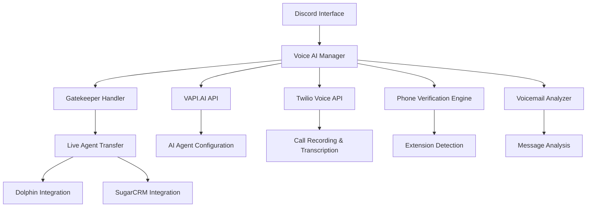

# Voice AI Implementation Plan - VAPI.AI Alternative

## Overview
Implementing a comprehensive Voice AI system for outbound calls, phone number verification, voicemail analysis, gatekeeper interactions, and live agent transfer capabilities integrated with Dolphin (NRG) and SugarCRM.

## Architecture Overview



## Core Components

### 1. Voice AI Manager Service

**Location**: `lib/voice-ai/voice-manager.ts`

```typescript
interface VoiceAIConfig {
  provider: 'vapi' | 'twilio' | 'hybrid';
  model: 'gpt-4' | 'gpt-3.5-turbo' | 'claude-3';
  voice: 'alloy' | 'echo' | 'fable' | 'onyx' | 'nova' | 'shimmer';
  language: 'en-US' | 'es-ES' | 'fr-FR';
  maxCallDuration: number; // seconds
  enableRecording: boolean;
  enableTranscription: boolean;
  transferToLive: boolean;
}

interface CallSession {
  sessionId: string;
  phoneNumber: string;
  purpose: 'verification' | 'outbound_sales' | 'gatekeeper' | 'follow_up';
  status: 'dialing' | 'connected' | 'analyzing' | 'transferring' | 'completed' | 'failed';
  duration: number;
  transcription?: string;
  outcome: 'answered' | 'voicemail' | 'busy' | 'no_answer' | 'transfer_success';
  gatekeeperNotes?: string;
  transferredTo?: string;
  crmUpdates?: any;
}
```

### 2. Phone Verification Engine

**Purpose**: Verify phone numbers by calling and listening to responses, detecting extensions, analyzing voicemails.

```typescript
class PhoneVerificationEngine {
  async verifyPhoneNumber(phoneNumber: string): Promise<VerificationResult> {
    // 1. Initiate call
    // 2. Listen for voice patterns
    // 3. Detect extensions/menu systems
    // 4. Analyze voicemail greetings
    // 5. Return verification status
  }

  async detectExtensions(callSession: CallSession): Promise<ExtensionInfo> {
    // Analyze audio for extension patterns
    // "Press 1 for sales, Press 2 for support"
    // Return available extensions
  }

  async analyzeVoicemail(audioBuffer: Buffer): Promise<VoicemailAnalysis> {
    // Use AI to analyze voicemail content
    // Extract business hours, contact info, urgency indicators
  }
}
```

### 3. Gatekeeper Interaction Handler

**Purpose**: Handle conversations with receptionists and gatekeepers, attempt to reach decision makers.

```typescript
class GatekeeperHandler {
  private systemPrompt = `
    You are a professional assistant calling on behalf of Kenneth Courtney from National Registration Group.
    
    Your role:
    1. Be polite and professional
    2. Explain you're calling about GSA Schedule opportunities
    3. Ask to speak with the business owner or decision maker
    4. If transferred, introduce the purpose again
    5. If asked for details, provide brief value proposition
    6. If no decision maker available, ask for best time to call back
    7. Always offer to transfer to a live specialist if needed
    
    Script examples:
    - "Hello, this is calling on behalf of Kenneth Courtney from National Registration Group"
    - "We help businesses access federal contracting opportunities through GSA Schedules"
    - "Could I speak with the business owner or someone who handles government contracts?"
    - "Would you like me to transfer you to one of our GSA specialists?"
  `;

  async handleGatekeeperCall(session: CallSession): Promise<GatekeeperResult> {
    // 1. Engage with gatekeeper using AI
    // 2. Attempt to reach decision maker
    // 3. Collect information about business
    // 4. Schedule callback if needed
    // 5. Transfer to live agent if requested
  }
}
```

### 4. Live Agent Transfer System

**Purpose**: Seamlessly transfer calls to live agents on Dolphin system when requested.

```typescript
class LiveAgentTransfer {
  async transferToLive(session: CallSession, reason: string): Promise<TransferResult> {
    // 1. Notify available agents on Dolphin
    // 2. Prepare transfer context (call notes, transcription)
    // 3. Execute warm transfer
    // 4. Update CRM with transfer details
  }

  async notifyDolphinAgents(transferContext: TransferContext): Promise<void> {
    // Send notification to Dolphin system
    // Include call context and urgency level
  }
}
```

## Integration Points

### 1. VAPI.AI Integration

**API Endpoints**: `app/api/voice-ai/vapi/`

```typescript
// app/api/voice-ai/vapi/route.ts
export async function POST(request: Request) {
  const { phoneNumber, purpose, customPrompt } = await request.json();
  
  const vapiConfig = {
    assistantId: process.env.VAPI_ASSISTANT_ID,
    phoneNumberId: process.env.VAPI_PHONE_NUMBER_ID,
    customer: {
      number: phoneNumber
    },
    assistantOverrides: {
      systemMessage: customPrompt || getDefaultPrompt(purpose)
    }
  };
  
  const response = await fetch('https://api.vapi.ai/call', {
    method: 'POST',
    headers: {
      'Authorization': `Bearer ${process.env.VAPI_API_KEY}`,
      'Content-Type': 'application/json'
    },
    body: JSON.stringify(vapiConfig)
  });
  
  return Response.json(await response.json());
}
```

### 2. Twilio Integration (Backup/Alternative)

**Endpoints**: `app/api/voice-ai/twilio/`

```typescript
// app/api/voice-ai/twilio/route.ts
export async function POST(request: Request) {
  const { phoneNumber, twimlUrl } = await request.json();
  
  const client = twilio(process.env.TWILIO_ACCOUNT_SID, process.env.TWILIO_AUTH_TOKEN);
  
  const call = await client.calls.create({
    to: phoneNumber,
    from: process.env.TWILIO_PHONE_NUMBER,
    url: twimlUrl,
    record: true,
    transcribe: true,
    transcribeCallback: '/api/voice-ai/twilio/transcription'
  });
  
  return Response.json({ callSid: call.sid });
}
```

### 3. Dolphin Integration

**Purpose**: Integrate with NRG's Dolphin system for agent notifications and transfers.

```typescript
// lib/integrations/dolphin-integration.ts
class DolphinIntegration {
  async notifyAgent(transferData: TransferData): Promise<void> {
    // Send notification to Dolphin system
    const notification = {
      type: 'voice_transfer',
      priority: transferData.priority,
      context: {
        phoneNumber: transferData.phoneNumber,
        callDuration: transferData.duration,
        transcription: transferData.transcription,
        leadQuality: transferData.leadQuality
      }
    };
    
    await fetch(process.env.DOLPHIN_WEBHOOK_URL, {
      method: 'POST',
      headers: { 'Content-Type': 'application/json' },
      body: JSON.stringify(notification)
    });
  }
}
```

### 4. SugarCRM Integration

**Purpose**: Update contact records with call results and schedule follow-ups.

```typescript
// lib/integrations/sugarcrm-integration.ts
class SugarCRMIntegration {
  async updateContactRecord(phoneNumber: string, callResult: CallResult): Promise<void> {
    const crmUpdate = {
      phone_work: phoneNumber,
      description: callResult.notes,
      call_status_c: callResult.outcome,
      next_call_date_c: callResult.followUpDate,
      gsa_qualified_c: callResult.gsaQualified
    };
    
    await this.sugarCrmClient.records.create('Contacts', crmUpdate);
  }
}
```

## Discord Interface Commands

### Voice AI Commands

```typescript
// Chat commands for voice AI operations
const voiceCommands = {
  '/call [phone-number] [purpose]': 'Initiate outbound call',
  '/verify-phone [phone-number]': 'Verify phone number and detect extensions',
  '/analyze-voicemail [call-id]': 'Analyze recorded voicemail',
  '/transfer-live [call-id]': 'Transfer active call to live agent',
  '/call-report [date-range]': 'Generate call activity report',
  '/setup-campaign [list-name]': 'Setup calling campaign'
};
```

### Usage Examples

```bash
# Verify a phone number
/verify-phone +1-555-123-4567

# Make a GSA qualification call
/call +1-555-123-4567 gsa_qualification

# Transfer current call to live agent
/transfer-live active

# Get call reports for today
/call-report today
```

## AI Agent Configurations

### 1. Phone Verification Agent

```typescript
const phoneVerificationPrompt = `
You are a professional phone verification assistant. Your goal is to:

1. Confirm the phone number reaches the intended business
2. Listen for automated menus and note available extensions
3. If you reach voicemail, analyze the greeting for business information
4. If you reach a person, politely explain you're verifying contact information
5. Do not attempt to sell anything during verification calls

Be brief, professional, and respectful of people's time.
`;
```

### 2. Gatekeeper Interaction Agent

```typescript
const gatekeeperPrompt = `
You are calling on behalf of Kenneth Courtney from National Registration Group, a GSA Schedule consulting firm.

Your objectives:
1. Reach the business owner or decision maker responsible for government contracts
2. If speaking to gatekeeper, be professional and explain the purpose
3. Offer brief value proposition if asked for details
4. Schedule callback if decision maker unavailable
5. Transfer to live specialist if prospect shows strong interest

Key talking points:
- GSA Schedules provide access to $600+ billion federal marketplace
- Guaranteed payment terms with government contracts
- We help businesses qualify and navigate the GSA process
- Free consultation to assess eligibility

Always offer to transfer to a live specialist for detailed discussions.
`;
```

### 3. Follow-up Call Agent

```typescript
const followUpPrompt = `
You are conducting a follow-up call for National Registration Group regarding GSA Schedule opportunities.

Your approach:
1. Reference previous interaction or inquiry
2. Ask about their current federal contracting goals
3. Provide relevant GSA Schedule information based on their industry
4. Address any concerns about the GSA process
5. Offer to schedule consultation with GSA specialist

Be consultative, not pushy. Focus on understanding their needs and providing value.
`;
```

## Implementation Timeline

### Phase 1: Core Infrastructure (Week 1-2)
- [ ] Set up VAPI.AI integration
- [ ] Implement basic call management
- [ ] Create Discord command interface
- [ ] Basic phone verification functionality

### Phase 2: Advanced Features (Week 3-4)
- [ ] Gatekeeper interaction handler
- [ ] Voicemail analysis
- [ ] Live agent transfer system
- [ ] CRM integration (SugarCRM)

### Phase 3: Dolphin Integration (Week 5)
- [ ] Dolphin system notifications
- [ ] Agent dashboard integration
- [ ] Call queue management
- [ ] Performance analytics

### Phase 4: Optimization & Scaling (Week 6)
- [ ] AI prompt optimization
- [ ] Call success rate analysis
- [ ] Automated campaign management
- [ ] Advanced reporting

## Environment Variables

```bash
# VAPI.AI Configuration
VAPI_API_KEY=your_vapi_api_key
VAPI_ASSISTANT_ID=your_assistant_id
VAPI_PHONE_NUMBER_ID=your_phone_number_id

# Twilio Configuration (Backup)
TWILIO_ACCOUNT_SID=your_twilio_sid
TWILIO_AUTH_TOKEN=your_twilio_token
TWILIO_PHONE_NUMBER=+1234567890

# Dolphin Integration
DOLPHIN_WEBHOOK_URL=https://dolphin.nrg.com/api/notifications
DOLPHIN_API_KEY=your_dolphin_api_key

# SugarCRM Integration
SUGARCRM_URL=https://your-sugarcrm-instance.com
SUGARCRM_USERNAME=your_username
SUGARCRM_PASSWORD=your_password

# AI Configuration
OPENAI_API_KEY=your_openai_key
VOICE_AI_MODEL=gpt-4
VOICE_AI_TEMPERATURE=0.3
```

## Security & Compliance

### Call Recording Compliance
- Implement proper consent mechanisms
- Follow state-specific recording laws
- Secure storage of recordings and transcriptions
- Data retention policies

### Privacy Protection
- Encrypt all call data
- Secure API key management
- GDPR/CCPA compliance for contact data
- Audit trails for all voice interactions

## Monitoring & Analytics

### Key Metrics
- Call connection rates
- Average call duration
- Transfer success rates
- Lead qualification rates
- Agent performance metrics

### Dashboards
- Real-time call monitoring
- Daily/weekly call reports
- Campaign performance analysis
- ROI tracking for voice AI vs human agents

## Benefits of This Implementation

1. **Automated Lead Qualification**: AI handles initial contact and qualification
2. **Extension Discovery**: Automatically maps company phone systems
3. **Gatekeeper Navigation**: Professional handling of receptionists and assistants
4. **Seamless Transfers**: Warm transfers to live agents when needed
5. **CRM Integration**: Automatic updates to contact records
6. **Scalability**: Handle high volumes of calls efficiently
7. **Consistency**: Standardized professional approach across all calls
8. **Analytics**: Detailed insights into call performance and outcomes

## Next Steps

1. **Choose Primary Provider**: VAPI.AI (recommended) or Twilio Voice
2. **Set Up Development Environment**: API keys and test phone numbers
3. **Create Initial AI Agent**: Start with phone verification use case
4. **Implement Discord Commands**: Basic call initiation and monitoring
5. **Test Integration**: Verify all components work together
6. **Deploy to Production**: Roll out gradually with monitoring

This implementation will provide Kenneth's team with a powerful voice AI system that can handle the bulk of outbound calling tasks while seamlessly transferring high-value prospects to live agents for closing. 