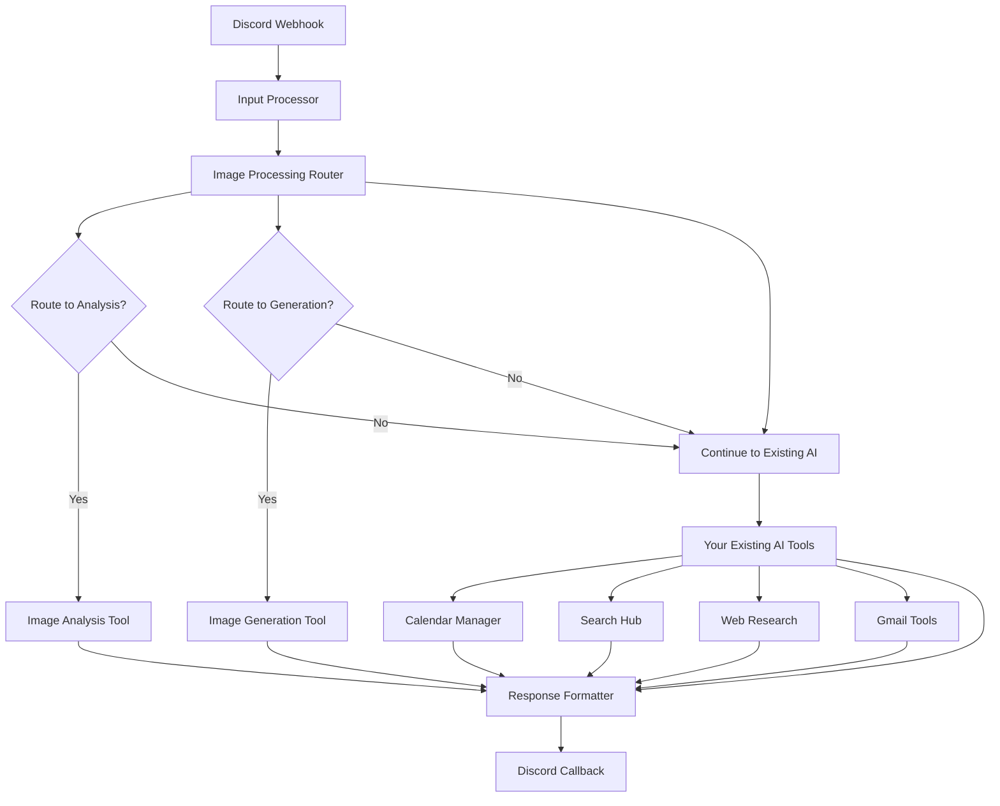

# Integrating Image Processing into Existing Discordant AI Bot Workflow

## Overview

Instead of creating a separate workflow, add the image processing capabilities to your existing `Discordant AI Bot v3.0` workflow to avoid endpoint conflicts.

## Integration Steps

### 1. Add Image Processing Router

**Location**: After your existing "Input Processor" node, before the main AI processing

**New Node**: JavaScript Code node named "Image Processing Router"
```javascript
// Add the complete image-processing-router.js code here
// This analyzes if the message needs image processing
```

### 2. Update Your Workflow Flow

**Current Flow:**
```
Webhook → Input Processor → [AI Tools/Processing] → Response Formatter → Callback
```

**New Flow:**
```
Webhook → Input Processor → Image Router → [Image Analysis | Image Generation | Standard AI] → Response Formatter → Callback
```

### 3. Add Conditional Routing

After the Image Router, add **IF nodes** to route based on `processing_type`:

**IF Node 1**: "Route to Image Analysis?"
- Condition: `{{ $json.processing_type === 'image_analysis' }}`
- True → Image Analysis Tool
- False → Continue to next IF

**IF Node 2**: "Route to Image Generation?"  
- Condition: `{{ $json.processing_type === 'image_generation' }}`
- True → Image Generation Tool
- False → Continue to your existing AI processing

### 4. Add New Processing Nodes

**Image Analysis Tool** (JavaScript Code node):
```javascript
// Add the complete image-analysis-tool.js code here
```

**Image Generation Tool** (JavaScript Code node):
```javascript
// Add the complete image-generation-tool.js code here
```

### 5. Update Response Formatter

Modify your existing Response Formatter to handle image processing results:

```javascript
// In your existing Response Formatter node, add:

const inputData = $input.first().json;
let finalContent = inputData.content || 'Processing completed';
let metadata = {
  messageId: inputData.messageId || inputData.metadata?.messageId,
  timestamp: new Date().toISOString(),
  processing_type: inputData.processing_type || 'standard'
};

// Add image processing metadata
if (inputData.analysis_result) {
  metadata.analysis = inputData.analysis_result;
}

if (inputData.generation_result) {
  metadata.generation = inputData.generation_result;
  // Include generated image URL
  if (inputData.generation_result.imageUrl) {
    metadata.imageUrl = inputData.generation_result.imageUrl;
  }
}

// Continue with your existing response formatting logic...
```

## Visual Workflow Structure



## Environment Variables

Add to your existing n8n environment:
```env
OPENAI_API_KEY=sk-your-openai-api-key
UPLOADTHING_SECRET=sk_live_your-uploadthing-secret
```

## Testing the Integration

1. **Image Analysis**: Upload an image and type "analyze this chart"
2. **Image Generation**: Type "generate a logo for a tech startup" 
3. **Standard AI**: Type "what's the weather today" (should work as before)

## Benefits of This Approach

- ✅ **No Endpoint Conflicts**: Uses existing webhook
- ✅ **Preserves Existing Functionality**: All current AI tools continue working
- ✅ **Unified Experience**: All AI capabilities in one workflow
- ✅ **Shared Context**: Image processing can use conversation history
- ✅ **Consistent Attribution**: Uses existing messageId handling

## Node Placement Tips

1. **Image Router**: Place immediately after Input Processor
2. **IF Nodes**: Place after Image Router, before existing AI branching
3. **Image Tools**: Place parallel to your existing AI tool nodes
4. **All Paths Converge**: At your existing Response Formatter

This integration maintains your existing sophisticated AI capabilities while adding powerful image processing features! 